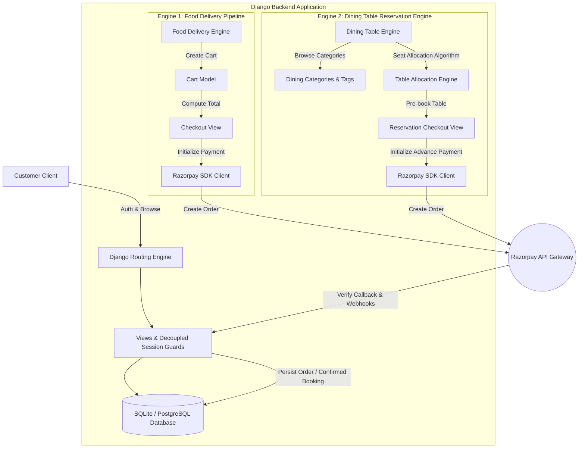
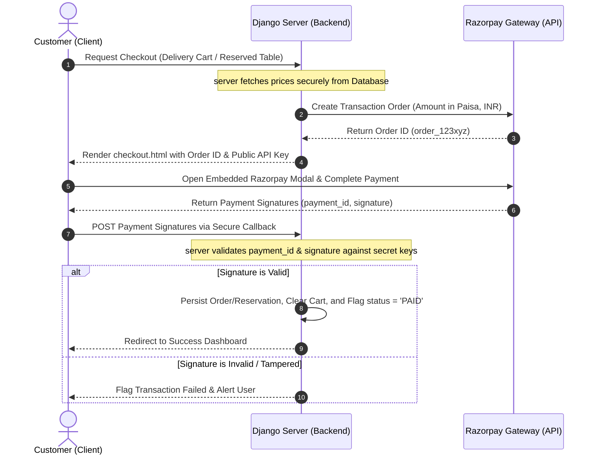
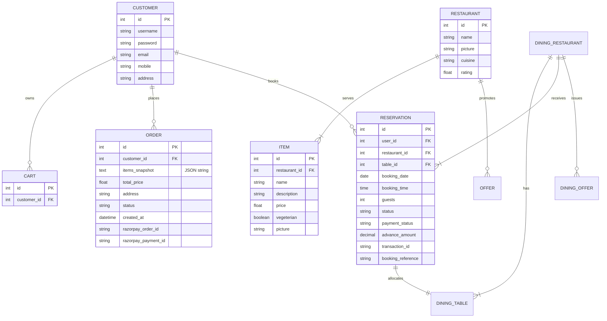

# 🍽️ Meal Buddy | Dual-Engine Food-Tech Platform

[](https://www.djangoproject.com/)
[](https://www.python.org/)
[](https://razorpay.com/)
[](#-security-hardening--production-readiness)

A premium, production-grade **Full-Stack Django SaaS Application** featuring a dual-service engine: **On-Demand Food Delivery** and **Dynamic Dining Table Reservation**. Designed with sleek glassmorphic aesthetics, robust session security, dynamic promo codes, and a fully integrated Razorpay payment gateway checkout flow.

---

## 🏗️ System Architecture & Workflow

Meal Buddy coordinates two core services using a unified relational database. The diagram below illustrates how customers interact with the delivery and dining engines:



---

## ⚡ Core Feature Matrix

### 1. On-Demand Food Delivery Engine
*   🛒 **Interactive Cart Mechanics:** Custom session-linked carts with real-time recalculations and dynamic recommendation algorithms displaying related menu items.
*   🎫 **Adaptive Promo Engines:** Apply flat or percentage discounts based on dynamic minimum order requirements (`MEAL150`, `WELCOME40`, `FREEDEL`).
*   🚚 **Order Status Pipeline:** Interactive order history tracking reflecting state progressions from **Order Placed** ➡️ **Preparing** ➡️ **On the Way** ➡️ **Delivered**.

### 2. Dining Table Reservation Engine
*   🏷️ **Categorized Fine Dining:** Explore partner restaurants filtered by collections (Rooftop, Pure Veg, Valet Parking, Serves Alcohol).
*   🪑 **Seat Allocation Engine:** Algorithmic matching filters dining tables based on guest capacity (`seats >= guests`) and real-time availability.
*   💳 **Reservation Fee Escrow:** Secure advance booking charges processed via payment gateways, providing unique alphanumeric booking references on confirmation.

### 3. Role-Based Administration Console
*   📈 **Inventory Control:** Complete CRUD dashboard for authorized managers to append/update restaurants, ratings, menu options, vegetarian tags, and promotional materials.
*   🛡️ **Custom Session Guards:** Elegant session-based authorization decorators (`@login_required_view` and `@admin_required_view`) shielding endpoint transactions.

---

## 💳 Razorpay Transaction Flow

All checkouts leverage a secure client-server exchange pattern that prevents client-side transaction tampering:



---

## 🛠️ Technology Stack & Dependencies

| Layer | Technology | Primary Package / Source |
| :--- | :--- | :--- |
| **Backend Core** | Django Web Framework v6.0.3 | `django` |
| **Language Runtime** | Python 3.12 / 3.13 | Native |
| **Payment Gateway** | Razorpay SDK v2.0.1 | `razorpay` |
| **Environment Control** | Python Dotenv v1.0.1 | `python-dotenv` |
| **Database Engine** | Relational DB Engine | SQLite (Development) / PostgreSQL (Production) |
| **Interface Styling** | Tailwind CSS & Modern Custom CSS | CDN & Custom glassmorphic styling |
| **Vector Icons** | FontAwesome Icon Packs v6.0 | CDN |

---

## 💾 Relational Database Schema

Meal Buddy relies on a highly coupled database model structure optimized for relational lookups:



---

## 🔒 Security Hardening & Production Readiness

The Meal Buddy codebase has undergone a robust security refactor to make it fully production-ready:
1.  **Environment Variables Offloading:** All high-security attributes (`SECRET_KEY`, `RAZORPAY_KEY_ID`, `RAZORPAY_KEY_SECRET`) are separated from the codebase and managed inside `.env` configuration.
2.  **Git Protection:** Standard `.gitignore` prevents leaks by systematically excluding `db.sqlite3`, `.env`, python caches (`__pycache__`), virtual environments, and system logs (`.DS_Store`).
3.  **Role-Based Security Guards:** Request authorization is enforced using custom session wrappers preventing customers from accessing administrator endpoints and dashboard route tampering.

---

## 🚀 Installation & Local Environment Setup

Follow these steps to configure a local sandbox environment:

### Prerequisites
*   Python 3.12+ installed
*   Git CLI installed

### 1. Clone the Codebase
```bash
git clone https://github.com/shetty-aditya-udaya/MealBuddy-Food-Delivery-and-Dining-Reservation-Platform.git
cd MealBuddy-Food-Delivery-and-Dining-Reservation-Platform
```

### 2. Configure Virtual Environment
Create and launch a virtual environment container:
```powershell
# Windows PowerShell
python -m venv venv
.\venv\Scripts\Activate.ps1
```
```bash
# macOS/Linux terminal
python3 -m venv venv
source venv/bin/activate
```

### 3. Install Package Dependencies
```bash
pip install -r requirements.txt
```

### 4. Isolate Environmental Variables
Duplicate the environment template:
```bash
cp .env.example .env
```
Open `.env` in a text editor and fill in your custom credentials:
```env
SECRET_KEY=generate-a-secure-random-string-here
DEBUG=True
ALLOWED_HOSTS=localhost,127.0.0.1
RAZORPAY_KEY_ID=rzp_test_YourKeyId
RAZORPAY_KEY_SECRET=YourKeySecret
```

### 5. Database Migrations & Seeding
Prepare your relational tables and seed development database values:
```bash
# Run database schema migrations
python manage.py migrate

# Seed delivery and reservation promotion data
python populate_offers.py
```

### 6. Boot the Local Server
```bash
python manage.py runserver
```
Visit the local server sandbox at `http://127.0.0.1:8000/` inside your browser.

---

## 🌟 Future Scale Enhancements
*   ⚡ **Redis Caching:** Cache high-frequency query lookups (e.g., dining categories, trending restaurants) to minimize DB load.
*   📬 **Celery Worker Integration:** Hand off email confirmations and order invoice PDF creations to an asynchronous Celery task queue with a RabbitMQ or Redis broker.
*   🗺️ **Dynamic Maps API Integration:** Integrate Google Maps Geocoding to query delivery distances and auto-populate shipping boundaries dynamically.

---

## 🧑‍💻 Engineering Takeaways
*   **Decoupled State Management:** Learned how to safely persist point-in-time item data (like pricing and descriptions) inside orders using custom JSON snapshots rather than linking items directly, protecting order history records from future inventory modifications.
*   **Secure Payment Integration:** Integrated external gateway services with strict cryptographic verification callbacks to prevent checkout manipulation.
*   **Dynamic Table Routing:** Designed seat allocation logic matching available table sizes against guest configurations dynamically.

---

## 📬 Contact and Showcases

*   **Developer:** Aditya Udaya Shetty
*   **GitHub:** [@shetty-aditya-udaya](https://github.com/shetty-aditya-udaya)
*   **Project Link:** [Meal Buddy Repository](https://github.com/shetty-aditya-udaya/MealBuddy-Food-Delivery-and-Dining-Reservation-Platform)
